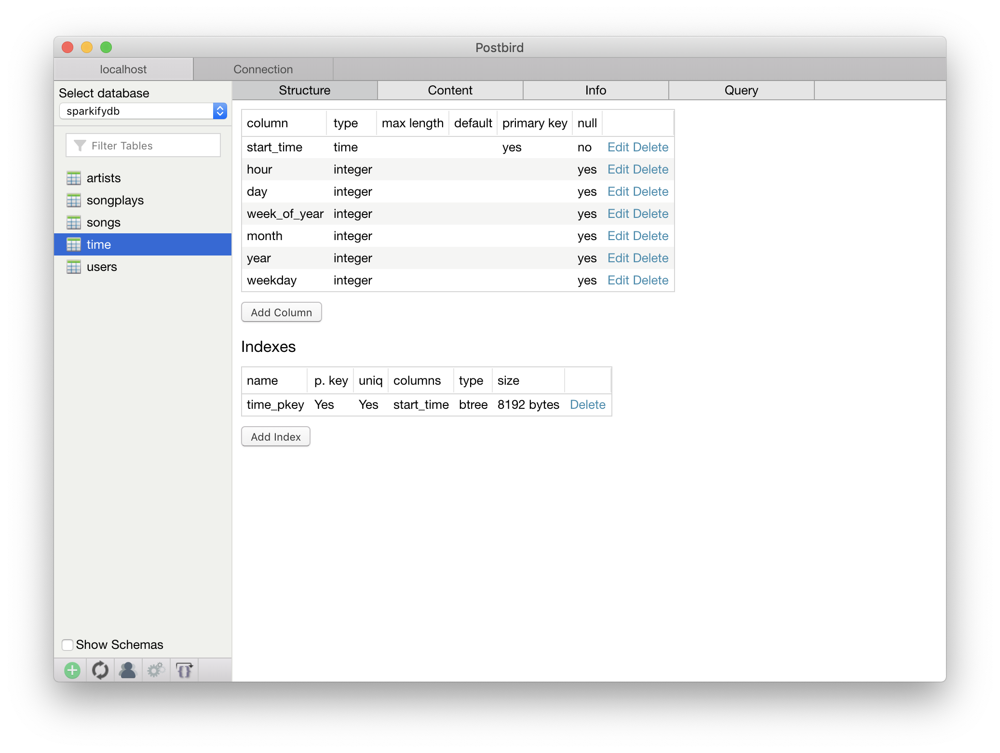

# Data Engineer Projet 1

## How to run the project
### Ensure that you have no current connections to the database open.
#### If you have just been in Jupyter notebook open the Kernel menu and click on Restart Kernel

### From the command line > python create_scripts.py
#### This will delete and re-create the database schema

### From the command line > python etl.py
#### This will execute the etl process.
#### First it will process the song data followed by the log data

## Background

Sparkify requires the ability to analyze data regarding which songs are being played.  

The database will contain 1 fact table and 4 dimension tables.  

## Table structure

### Song 

### Artist

### Time

### User

### Songplay

